<a id="top"></a>

<div align="center">



<br><br>

<a href="https://blog.naver.com/ejdnjs0930"></a>
<a href="mailto:ejdnjs0930@gmail.com"></a>


</div>


<br>

<div align="center">

## ⚡ whoami



</div>

<br>

## 🐧 TOCO UNIVERSE

> 토코(TOCO)는 펭귄+고양이 AI 캐릭터이자, 내가 만드는 모든 것의 구심점.
> 하나의 캐릭터를 중심으로 영상 파이프라인 → 에이전트 → 인텔리전스 → 라이프까지 확장 중.

```mermaid
%%{init: {'theme':'base','themeVariables':{'primaryColor':'#0D1420','primaryTextColor':'#E6EDF3','primaryBorderColor':'#22D3EE','lineColor':'#8B949E','fontFamily':'monospace','mainBkg':'#0D1420','edgeLabelBackground':'#000000','clusterBkg':'#05070B','clusterBorder':'#1F2733','tertiaryTextColor':'#E6EDF3'}}}%%
flowchart LR
    TOCO(["🐧 TOCO<br/>펭귄 + 고양이 AI"])
    style TOCO fill:#0D1420,stroke:#FFC831,stroke-width:2px

    TOCO --> V["🎬 영상 파이프라인"]
    TOCO --> A["🤖 에이전트"]
    TOCO --> I["📈 인텔리전스"]
    TOCO --> L["🧭 라이프 & 시티"]

    V --> V1["toko-creator<br/>AI 숏폼 자동 생성"]
    V --> V2["toco-dubbing<br/>영상 → 한국어 자막 MP4"]
    V --> V3["즉석자막<br/>실시간 자막 데스크톱 앱"]

    A --> A1["Orchestrator<br/>에이전트 배포 지휘"]
    A --> A2["dn8-assistant<br/>차량 AI 비서"]
    A --> A3["claude-pet<br/>데스크톱 펫 에이전트"]

    I --> I1["Stockmind<br/>개인 투자 두뇌"]
    I --> I2["opportunity-os<br/>AI Sales Agent"]
    I --> I3["gapminer<br/>1인 제품 기회 발굴"]

    L --> L1["tocosteps<br/>추억 동선 아카이브"]
    L --> L2["Real-Proceedings<br/>AI 회의록"]
    L --> L3["Changwon-Digital-Twin<br/>도시 디지털 트윈"]
```



<br>

## 🚀 지금 만들고 있는 것들

> 대부분 🔒 private — 솔로 메이커의 실험실은 원래 문이 닫혀 있다. 완성되면 하나씩 공개.

| 프로젝트 | 무엇을 하는 물건인가 | 스택 | 상태 |
|---|---|---|---|
| 🧠 **Stockmind** | 한국 주식을 AI가 분석·시뮬레이션하고 내 매매를 복기해 주는, 나 혼자 쓰는 투자 두뇌 — 단정 금지, 확률과 근거만 | `TypeScript` | 🔒 운용 중 |
| 🤖 **Orchestrator** | 오케스트레이터의 지시로 프로젝트에 필요한 에이전트를 배포하는 멀티 에이전트 플러그인 | `JavaScript` | 🔒 연구 중 |
| 🎬 **toko-creator** | 토코 캐릭터가 진행하는 AI 숏폼 자동 생성 시스템 | `Python` | 🔒 빌드 중 |
| 🎙 **Real-Proceedings** | 실시간 STT + 화자 분리 + 끝나면 AI 요약까지, 개인용 회의록 앱 | `TypeScript` | 🔒 빌드 중 |
| 🏙 **Changwon-Digital-Twin** | 창원시 데이터를 3D 지도에 올리고 교통·날씨·대기질·재난을 실시간 패널로 — 로컬 우선 디지털 트윈 | `TypeScript` | 🔒 빌드 중 |


## 🛠️ 기술 스택

<div align="center">


<br><br>


</div>

<br>


<!-- ACTIVITY-TELEMETRY:START -->

<div align="center">

<h3>🕐 시간대별 커밋 활동</h3>
<sub>전체 누적</sub>


<br><br>

<table><tr>
<td align="center" valign="top">
<picture>
  
</picture>
</td>
<td align="center" valign="top">
<picture>
  
</picture>
</td>
</tr></table>

<br>

<sub>마지막 갱신: 2026-07-03 01:00 KST · GitHub Actions 자동 생성</sub>

</div>

<!-- ACTIVITY-TELEMETRY:END -->

<br>

<div align="center">

## 🐍 잔디 먹는 뱀

<sub>잔디의 대부분은 private 레포에 숨어 있다 — 뱀은 보이는 것만 먹는다.</sub>

<br><br>

<picture>
  <source media="(prefers-color-scheme: dark)" srcset="https://raw.githubusercontent.com/T0C0-AI/T0C0-AI/output/snake-dark.svg" />
  <source media="(prefers-color-scheme: light)" srcset="https://raw.githubusercontent.com/T0C0-AI/T0C0-AI/output/snake.svg" />
  
</picture>

</div>

<br>

## ⚑ 원칙

```text
[01] 배포되지 않은 코드는 존재하지 않는 코드다.
[02] AI는 도구가 아니라 팀원이다. 나는 지휘자다.
[03] 혼자서도 팀의 속도를 낸다 — 그게 솔로 메이커의 증명.
[04] 디테일이 퀄리티를 만든다 — 마지막 1px까지.
```


<div align="center">
<sub>이 페이지의 히어로 · 터미널 · 디바이더 · 푸터는 라이브러리 없이 손으로 만든 애니메이션 SVG입니다 ✋</sub>
<br>
<sub>텔레메트리는 매일 00:00 KST, 뱀은 00:10 KST에 GitHub Actions가 자동 갱신</sub>
<br><br>
<a href="#top"></a>
<br><br>
</div>
