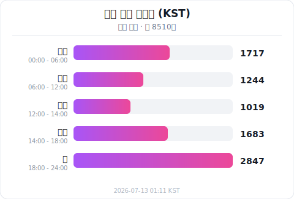
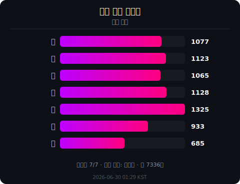

  
   

  

    
  

  

    
    
    
  

---

### 🖋️ 프로젝트 선언

> **토코AI**는 **멀티 에이전트 오케스트레이션**, **자율 판단 시스템**, **AI 협업 플랫폼**의 교차점에 위치한 차세대 AI 인프라입니다. 개발 철학의 근간은 **"팀으로 일하는 AI"** — 단일 AI의 한계를 넘어, 에이전트들이 유기적으로 협력하는 시스템 아키텍처.
>
> 하나의 Orchestrator가 수십 개의 전문화 에이전트를 지휘하고, 실시간으로 작업을 위임하며, 결과를 검증하는 **에이전트 오케스트레이션 플랫폼**입니다. **음성 인식**에서 **데스크톱 자동화**, **문서 RAG**에서 **코드 레시피 생성**까지 — 지능이 팀으로 움직입니다.

 

<!-- Featured Projects -->

## ✨ FEATURED PROJECTS

 

|  |  |  |
| :---: | :---: | :---: |
| **[toco-computer](https://github.com/T0C0-AI/toco-computer)** | **[toco-voice](https://github.com/T0C0-AI/toco-voice)** | **[toco-orchestrator](https://github.com/T0C0-AI/toco-orchestrator)** |
| `macos`, `automation`, `desktop`, `ai-agent` | `voice`, `transcription`, `real-time`, `multilingual` | `orchestration`, `ai-agents`, `plugin`, `claude-ai` |
| macOS 데스크톱을 AI가 직접 제어하는 오케스트레이터 에이전트 | AI 기반 회의 전사 및 실시간 다국어 동시통역 시스템 | 에이전트 배포 및 작업 지시를 담당하는 플러그인 허브 |
|  |  |  |
| **[toco-max](https://github.com/T0C0-AI/toco-max)** | **[toco-recipe](https://github.com/T0C0-AI/toco-recipe)** | **[toco-rag](https://github.com/T0C0-AI/toco-rag)** |
| `ai`, `claude-ai`, `orchestration`, `typescript` | `recipe`, `code-generation`, `analysis`, `ai` | `rag`, `knowledge-base`, `vector-db`, `document` |
| 토코 에이전트 팀의 핵심 두뇌 — 최상위 오케스트레이션 시스템 | 프로젝트를 분석해 레시피를 자동 생성하는 AI 빌더 | 개인 문서를 인덱싱하는 RAG 기반 지식 백과사전 |

 

  

  

## 🛠️ 기술 도메인 & 에코시스템

| 🔌 Orchestration & Platform | 🧠 Intelligence & AI | ⚡ Systems & Automation |
|:---:|:---:|:---:|
| 멀티 에이전트 배포, MCP 통합, 이벤트 라우팅 | RAG, 음성 처리, 패턴 인식, 컴퓨터 비전 | 데스크톱 자동화, CI/CD, 시스템 프로그래밍 |
|    |    |    |

  

## 🚀 핵심 에이전트 이니셔티브 (2026)

| 에이전트 | 시스템 역할 | 핵심 기술 | 운영 상태 |
| :---: | :---: | :---: | :---: |
| **[Orchestrator](https://github.com/T0C0-AI)** | 멀티 에이전트 배포 & 조율 | `Claude API` `MCP` `TypeScript` | 🟢 **Active** |
| **[Voice](https://github.com/T0C0-AI)** | 실시간 음성 처리 & 통역 | `Whisper` `Translation` `Streaming` | 🟢 **Nominal** |
| **[Computer](https://github.com/T0C0-AI)** | macOS 데스크톱 자동화 | `Native API` `OCR` `UI Control` | 🟢 **Full Deploy** |
| **[RAG](https://github.com/T0C0-AI)** | 지식 관리 & 시맨틱 검색 | `Vector DB` `Embeddings` `Graph` | 🟢 **Production** |
| **[Recipe](https://github.com/T0C0-AI)** | 프로젝트 인텔리전스 & 드리프트 감지 | `Pattern Analysis` `AST` `Scaffold` | 🟢 **Verified** |
| **[Automation](https://github.com/T0C0-AI)** | 이벤트 기반 워크플로우 자동화 | `Notion API` `Slack` `Discord` | 🟢 **Active** |
| **[Recognition](https://github.com/T0C0-AI)** | 제스처 & 안면인식 보안 시스템 | `Computer Vision` `PyTorch` `Edge AI` | 🟡 **Iterating** |
| **[Visibility](https://github.com/T0C0-AI)** | 팀 모니터링 & 실시간 대시보드 | `Telemetry` `Real-time Analytics` | 🟡 **Iterating** |

  

## 📂 에이전트 아키텍처 포트폴리오

<b>🔌 Orchestration Layer — 멀티 에이전트 조율 시스템</b>

| 에이전트 | 핵심 기술 |
| :---: | :---: |
| [Dispatcher](https://github.com/T0C0-AI) | `Claude API` `Natural Language` `Routing` |
| [Architect](https://github.com/T0C0-AI) | `Claude Opus` `Read-only Analysis` `Constraint Definition` |
| [Worker-Design](https://github.com/T0C0-AI) | `TypeScript` `Architecture Planning` `Spec Writing` |
| [Worker-Implement](https://github.com/T0C0-AI) | `TypeScript` `Code Generation` `TDD` |
| [Worker-Review](https://github.com/T0C0-AI) | `Static Analysis` `Quality Gate` `Best Practices` |
| [Worker-Debug](https://github.com/T0C0-AI) | `Trace Analysis` `Root Cause` `Fix Patch` |
| [Verifier](https://github.com/T0C0-AI) | `Independent Validation` `OMC Verifier` `Quality Assurance` |
| [Tracer](https://github.com/T0C0-AI) | `Failure Diagnosis` `OMC Tracer` `Error Analysis` |

<b>🧠 Intelligence Layer — RAG & 음성 처리 시스템</b>

| 에이전트 | 핵심 기술 |
| :---: | :---: |
| [RAG Engine](https://github.com/T0C0-AI) | `Vector DB` `Semantic Search` `Embeddings` |
| [Knowledge Graph](https://github.com/T0C0-AI) | `Graph Theory` `Document Relations` `Inference` |
| [Voice Transcription](https://github.com/T0C0-AI) | `Whisper` `Real-time Streaming` `Speaker Diarization` |
| [Live Translator](https://github.com/T0C0-AI) | `Multilingual` `Ko / En / Ja / Zh` `Low Latency` |
| [Meeting Assistant](https://github.com/T0C0-AI) | `Summarization` `Action Items` `Auto Minutes` |

<b>⚡ Automation Layer — 데스크톱 & 워크플로우 자동화</b>

| 에이전트 | 핵심 기술 |
| :---: | :---: |
| [Computer Agent](https://github.com/T0C0-AI) | `macOS API` `Screen Capture` `UI Automation` |
| [OCR Engine](https://github.com/T0C0-AI) | `Vision` `Text Extraction` `Layout Analysis` |
| [Notion Connector](https://github.com/T0C0-AI) | `Notion API` `Database Sync` `Page Creation` |
| [Slack Connector](https://github.com/T0C0-AI) | `Slack API` `Event Triggers` `Message Routing` |
| [Discord Connector](https://github.com/T0C0-AI) | `Discord API` `Bot Integration` `Webhook` |

<b>🛡️ Platform Layer — 레시피 & 보안 시스템</b>

| 에이전트 | 핵심 기술 |
| :---: | :---: |
| [Recipe Analyzer](https://github.com/T0C0-AI) | `Project Analysis` `Pattern Learning` `supermemory` |
| [Drift Checker](https://github.com/T0C0-AI) | `Code-Doc Comparison` `AST Analysis` `CI Hook` |
| [Scaffold Engine](https://github.com/T0C0-AI) | `Template Generation` `Boilerplate` `Recipe-Based` |
| [PR Guard](https://github.com/T0C0-AI) | `Recipe Validation` `CI Integration` `Compliance` |
| [Recognition](https://github.com/T0C0-AI) | `Face Recognition` `Gesture Detection` `Edge Inference` |

---

  

## 📊 시스템 메트릭스 & 분석
  
  

 

<!-- ACTIVITY-TELEMETRY:START -->

<h3>🕐 시간대별 커밋 활동</h3>
전체 누적

  

<picture>
  
</picture>

  

<picture>
  
</picture>

 

마지막 갱신: 2026-04-29 19:45 KST · GitHub Actions 자동 생성

<!-- ACTIVITY-TELEMETRY:END -->

  

---

## 🔌 통합 & 에코시스템
  
  
  

<b>📜 MCP 서버 & 외부 통합 전체 목록</b>

 

| 구분 | 서비스 | 역할 | 상태 |
| :--- | :--- | :--- | :--- |
| MCP | Notion | 데이터베이스 동기화, 페이지 자동 생성 | 🟢 Active |
| MCP | Gmail | 이메일 읽기 / 전송 자동화 | 🟢 Active |
| MCP | Google Calendar | 일정 조회 & 이벤트 생성 | 🟢 Active |
| MCP | Canva | 디자인 생성 & 에셋 관리 | 🟢 Active |
| MCP | Crypto.com | 실시간 시장 데이터 조회 | 🟢 Active |
| MCP | Excalidraw | 다이어그램 생성 & 저장 | 🟢 Active |
| API | Claude Opus 4.6 | 아키텍처 분석, 고품질 추론 (읽기 전용) | 🟢 Active |
| API | Claude Sonnet 4.6 | 범용 에이전트 실행 & 코드 생성 | 🟢 Active |
| API | Whisper | 실시간 음성 전사 | 🟢 Active |
| Platform | GitHub Actions | CI/CD 자동화 & PR Guard | 🟢 Active |
| Platform | Slack | 팀 알림 & 이벤트 트리거 | 🟢 Active |
| Platform | Discord | 커뮤니티 봇 통합 | 🟡 Iterating |
| Platform | Telegram | 실시간 알림 푸시 | 🟡 Iterating |

---

## ⚖️ 개발 철학 & 비전

> *"하나의 AI가 아닌, 팀으로 움직이는 AI. — K-Studio"*

- **시스템 전략**: 에이전트는 도구가 아니라 동료다.
- **운영 원칙**: 자동화는 사람을 대체하지 않는다. 사람이 더 중요한 일에 집중하게 한다.
- **아키텍처 비전**: 복잡성을 단순함으로 증류하는 것이 진정한 설계다.
- **논리 & 이성**: 팀으로 일하는 AI가, 혼자인 AI보다 강하다.

---

 

  
    
  
   
  <i>"Architecture is intelligence, distributed." — T0C0 AI</i>
    
  <b>T0C0 AI</b> 
  <i>AI Agent Orchestration | Autonomous Multi-Agent Platform</i> 
   
  
   
  <small>© 2026 — Built with Precision & Intent by 강다니엘 | K-Studio</small>

