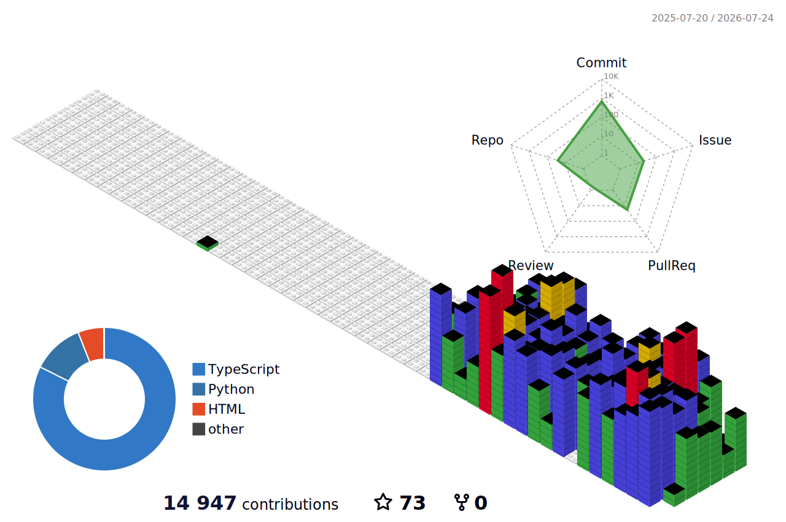

  

 

## 🛠️ 기술 스택

  

 

## ⚡ whoami

모니터 3면 · RGB 키보드 · 김 나는 커피 · 책상 위엔 토코 — 여기서 다 만든다

 

## 🌈 3D 컨트리뷰션

1년치 활동을 3D 블록으로 쌓았다 — private 기여까지 포함한 진짜 밀도.

  

 

## 🏙 토코 시티

내가 만든 프로젝트들이 사는 도시 — 토코가 마스코트로 지킨다

 

 

## 🚀 지금 만들고 있는 것들

> 대부분 🔒 private — 솔로 메이커의 실험실은 원래 문이 닫혀 있다. 완성되면 하나씩 공개.

| 프로젝트 | 무슨 내용인가 | 스택 | 상태 |
|---|---|---|---|
| 🧠 **스톡마인드** | 한국 주식을 AI가 분석·시뮬레이션하고 내 매매를 복기해 주는, 나 혼자 쓰는 투자 두뇌 — 단정 금지, 확률과 근거만 | `TypeScript` | 🔒 운용 중 |
| 🤖 **토코 오케스트레이터** | 오케스트레이터의 지시로 프로젝트에 필요한 에이전트를 배포하는 멀티 에이전트 플러그인 | `JavaScript` | 🔒 연구 중 |
| 🎬 **토코 크레이터** | 토코 캐릭터가 진행하는 AI 숏폼 자동 생성 시스템 | `Python` | 🔒 빌드 중 |
| 🎙 **실시간 회의록** | 실시간 STT + 화자 분리 + 끝나면 AI 요약까지, 개인용 회의록 앱 | `TypeScript` | 🔒 빌드 중 |
| 🏙 **창원 실시간 디지털 트윈** | 창원시 데이터를 3D 지도에 올리고 교통·날씨·대기질·재난을 실시간 패널로 — 로컬 우선 디지털 트윈 | `TypeScript` | 🔒 빌드 중 |

 

대표작 4종 — 각각 하나의 작은 세계

 

<!-- ACTIVITY-TELEMETRY:START -->

<h3>🕐 시간대별 커밋 활동</h3>
전체 누적

  

<table><tr>
<td align="center" valign="top">

</td>
<td align="center" valign="top">

</td>
</tr></table>

 

마지막 갱신: 2026-07-18 01:34 KST · GitHub Actions 자동 생성

<!-- ACTIVITY-TELEMETRY:END -->

 

이 페이지의 히어로 · 아이소메트릭 작업실 · 토코 시티 · 프로젝트 디오라마 · 푸터는 라이브러리 없이 손으로 만든 애니메이션 SVG입니다 ✋
 
텔레메트리·3D 컨트리뷰션은 매일 자정(KST) GitHub Actions가 자동 갱신
  

  

