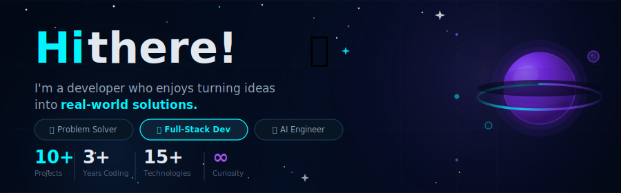

<!-- ─────────────────────────── HEADER BANNER ─────────────────────────── -->

  

<!-- ─────────────────────────── DASHBOARD ─────────────────────────── -->
<table border="0" width="100%">
<tr>

<!--
  LEFT PANEL — Profile Card
-->
<td width="26%" valign="top" align="center">

 

  

**강다니엘**

[`@T0C0-AI`](https://github.com/T0C0-AI)

 

*"Code. Learn. Build. Repeat."*

 

📍 Seoul, Republic of Korea 
📝 [blog.naver.com/ejdnjs0930](https://blog.naver.com/ejdnjs0930) 
📧 ejdnjs0930@gmail.com 
🐦 [@T0C0-AI](https://twitter.com) 
📅 Joined Jan 2024

 

---

**GitHub Achievements**

---

**Profile Views**

</td>

<!--
  RIGHT PANEL — Main Content
-->
<td width="74%" valign="top">

<!-- ── ROW 1: Tech Stack · GitHub Stats · Contribution Activity ── -->
<table border="0" width="100%">
<tr>

<td width="34%" valign="top">

**🔧 Tech Stack**

`Frontend`

`Backend & AI`

`DevOps & Tools`

</td>

<td width="33%" valign="top">

**📊 GitHub Stats** &nbsp;&nbsp; `Last 12 months`

</td>

<td width="33%" valign="top">

**⏰ Contribution Activity** &nbsp;&nbsp; `2026`

</td>

</tr>
</table>

 

---

<!-- ── ROW 2: FEATURED PROJECTS ── -->

**⭐ Featured Projects** &nbsp;&nbsp;&nbsp; [View all repositories →](https://github.com/T0C0-AI?tab=repositories)

<table border="0" width="100%">
<tr>

<td width="25%" valign="top">

</td>

<td width="25%" valign="top">

</td>

<td width="25%" valign="top">

</td>

<td width="25%" valign="top">

</td>

</tr>
</table>

 

---

<!-- ── ROW 3: 커밋 활동 시간대 / 전체 활동 리포트 ── -->

**📈 커밋 활동 리포트**

<!-- ACTIVITY-TELEMETRY:START -->
<table border="0" width="100%">
<tr>
<td width="50%" align="center">

</td>
<td width="50%" align="center">

</td>
</tr>
</table>
<!-- ACTIVITY-TELEMETRY:END -->

 

<!-- ── ROW 4: Contribution Graph ── -->

</td>
</tr>
</table>

---

  
   
  <small>© 2026 — Built with Precision &amp; Intent by 강다니엘 | K-Studio</small>

