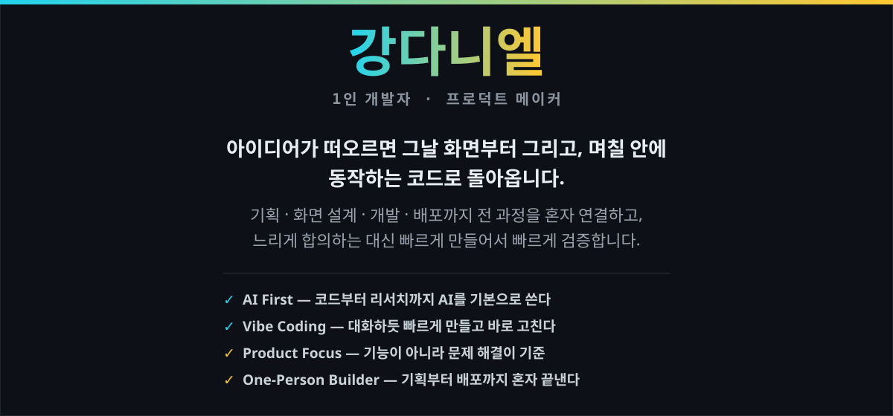
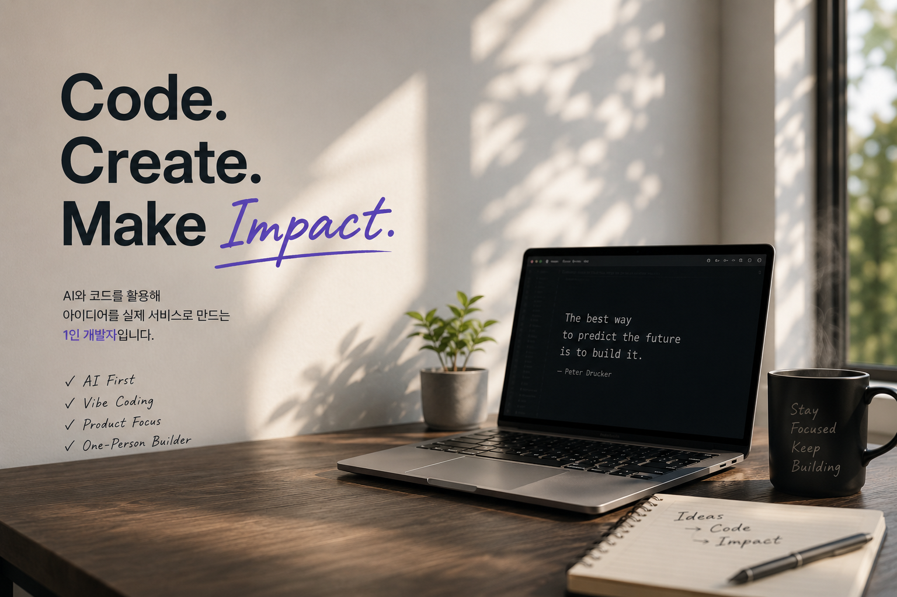
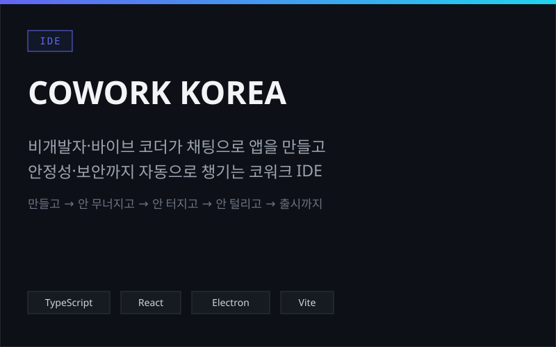
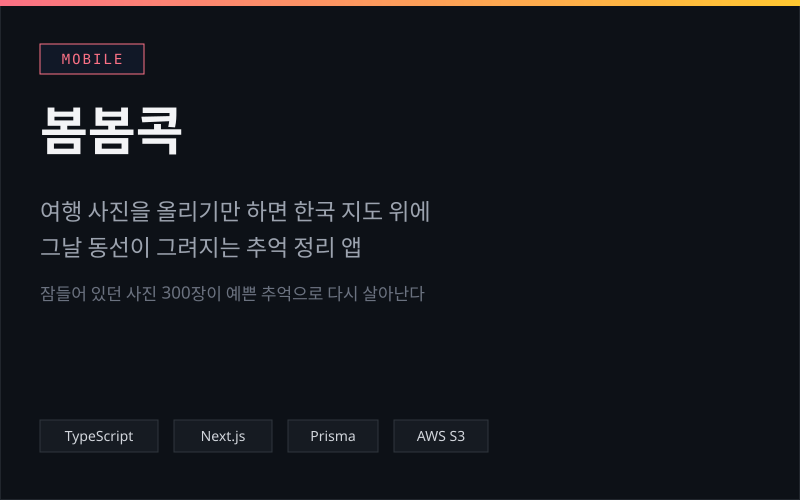
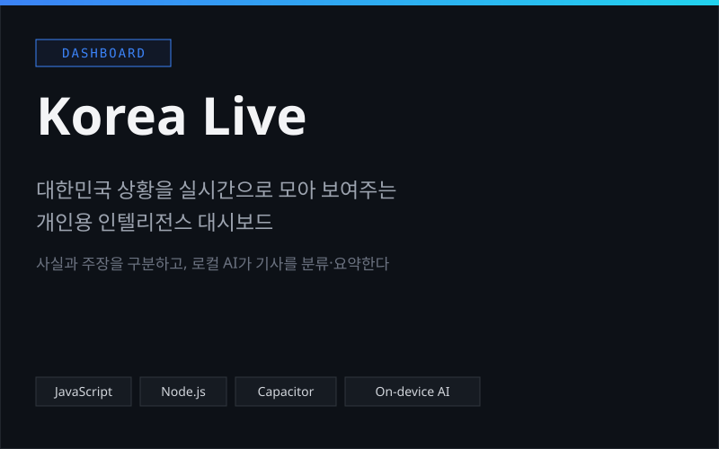
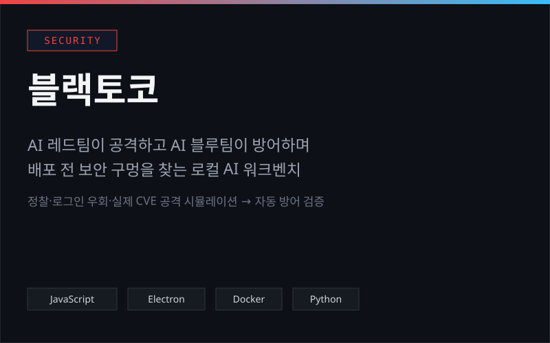
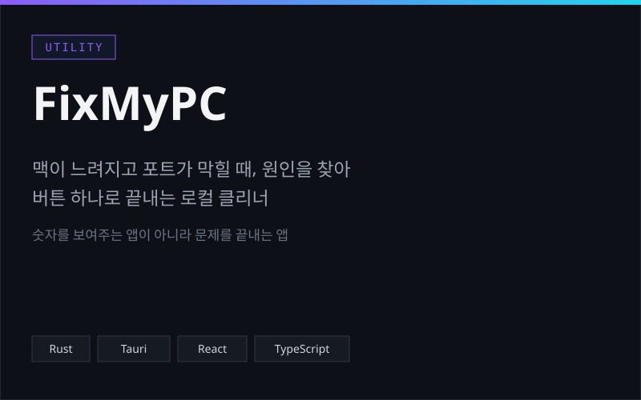
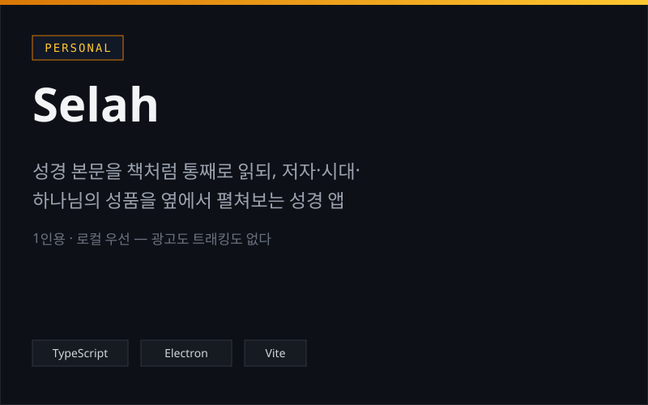

 

  

### 🛠️ 기술 스택

<table align="center">
<tr>
  <td align="center" width="96"> TypeScript</td>
  <td align="center" width="96"> JavaScript</td>
  <td align="center" width="96"> Python</td>
  <td align="center" width="96"> Kotlin</td>
  <td align="center" width="96"> Dart</td>
</tr>
<tr>
  <td align="center" width="96"> Rust</td>
  <td align="center" width="96"> React</td>
  <td align="center" width="96"> Next.js</td>
  <td align="center" width="96"> Solid.js</td>
  <td align="center" width="96"> Vite</td>
</tr>
<tr>
  <td align="center" width="96"> Electron</td>
  <td align="center" width="96"> Tauri</td>
  <td align="center" width="96"> Node.js</td>
  <td align="center" width="96"> FastAPI</td>
  <td align="center" width="96"> Tailwind CSS</td>
</tr>
<tr>
  <td align="center" width="96"> Prisma</td>
  <td align="center" width="96"> Docker</td>
  <td align="center" width="96"> GitHub Actions</td>
  <td align="center" width="96"> Git</td>
  <td align="center" width="96"> GitHub</td>
</tr>
<tr>
  <td align="center" width="96"> VS Code</td>
  <td align="center" width="96"> AWS</td>
  <td align="center" width="96"> Vercel</td>
  <td align="center" width="96"> Linux</td>
  <td align="center" width="96"> Bash</td>
</tr>
</table>

 

## 🚀 내가 만든 AI 제품들

✨ Claude Code로 혼자 기획·개발·배포까지 끝내는 1인 제품 스튜디오

 

<table>
<tr>
<td width="33%" valign="top">

**🧑‍💻 COWORK KOREA**
 비개발자·바이브 코더가 채팅으로 앱을 만들고 안정성·보안까지 자동으로 챙기는 종합 코워크 IDE
 `TypeScript` `React` `Electron` `Vite`

</td>
<td width="33%" valign="top">

**🌸 봄봄콕**
 여행 사진을 자동으로 모아 지도 위에 동선을 그려주는 추억 정리 앱
 `TypeScript` `Next.js` `Prisma` `AWS S3`

</td>
<td width="33%" valign="top">

**🇰🇷 Korea Live**
 대한민국 상황을 실시간으로 모아 보여주는 개인용 인텔리전스 대시보드
 `JavaScript` `Node.js` `Capacitor`

</td>
</tr>
<tr>
<td width="33%" valign="top">

**🛡️ 블랙토코**
 AI 레드팀이 공격하고 AI 블루팀이 방어하며 배포 전 보안 구멍을 찾는 로컬 AI 레드팀 워크벤치
 `JavaScript` `Electron` `Docker` `Python`

</td>
<td width="33%" valign="top">

**🧹 FixMyPC**
 맥이 느려지고 포트가 막힐 때 원인을 찾아 버튼 하나로 끝내는 로컬 클리너
 `Rust` `Tauri` `React` `TypeScript`

</td>
<td width="33%" valign="top">

**📖 Selah**
 성경 본문을 책처럼 읽되 저자·시대·성품을 옆에서 펼쳐보는 1인용 로컬 성경 앱
 `TypeScript` `Electron` `Vite`

</td>
</tr>
</table>

 

<!-- ACTIVITY-TELEMETRY:START -->

<h3>🕐 시간대별 커밋 활동</h3>

  

<table><tr>
<td align="center" valign="top">

</td>
<td align="center" valign="top">

</td>
</tr></table>

 

마지막 갱신: 2026-08-02 00:36 KST · GitHub Actions 자동 생성

<!-- ACTIVITY-TELEMETRY:END -->

 

프로젝트 카드·구분선·푸터는 라이브러리 없이 손으로 만든 SVG입니다 ✋
 
텔레메트리는 매일 자정(KST) GitHub Actions가 자동 갱신
  

  

